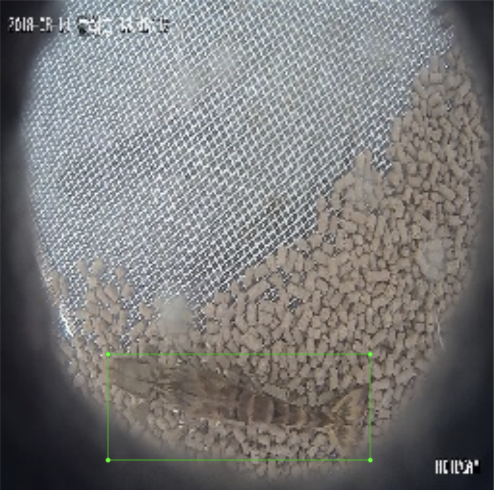

## 若有任何文題 直接在 Slack 的標記 channel提出
## 需求軟體
---
- Python 3
- opencv2
- labelImg

將黃老師提供資料做標註
----------------
## 按照可見距離
- 小於30cm
- 30~40cm
- 40~50cm
- 大於50cm
- 未分類(?
------
## 再按照影像類型可分  
- 可見光(Visible)
  - 清澈水質
  - 綠色水（油綠、黃綠、履帶褐等）--優勢種類多為硅藻和隱藻
  -  褐色水（黃褐、紅褐、褐帶綠等）---優勢種類多為硅藻，同時有較多的微細浮游植物
  - 微霧
- 紅外線(Infrared，IR)

--------
## 綜合兩者可歸納
|          | 清澈           | 黃褐色   | 綠色            | 紅外線         |
|----------|----------------|----------|-----------------|----------------|
| 小於30cm |                |          |                 | 4部3GB         |
| 30~40cm  |                |          | 13部3GB         | 14部3GB        |
| 40~50cm  |                |          | 12部50MB10部3GB | 10部20MB7部3GB |
| 大於50cm | 77部(200M~1GB) | 3部300MB | 18部50MB        | 77部100MB      |
| 未分類   |                |          |                 |                |

## 如何標註資料
-------------------
#### 安裝 [labelImg](https://github.com/tzutalin/labelImg)
至官方的GitHub下載至電腦
#### 選擇要標註的影片
[Google drive 下載連結 需要要求權限](https://drive.google.com/drive/u/2/folders/17Q1iPxzFqPdqgBEmM-UsBOuUG3jNJzlz)
####
### [標注工作狀況 若選好影片請先至上面填寫自己要標記](https://docs.google.com/spreadsheets/d/1HCeAVAgSzXgvFgp8n0pveacWBxs7ugrcq120C-VNq1Q)
### 影片列表
#### 小於30cm
 - 紅外線(26.5cm)
   - `6_08_R_190201050000.avi`
#### 30~40cm
 - 紅外線(35cm)
   - `22_08_R_190201200000.avi`
   - `23_08_R_190201210000.avi`
 - 綠色(35cm) 
   - 時間點在早上10點 `37_08_R_190202100000.avi`
   - 雜質相對多 時間點在中午12點 `39_08_R_190202120000.avi`
 - 綠色(38.5cm) 
   - 有些許雜質 `10_08_R_190203080000.avi`
   - 雜質相對多 `15_08_R_190203130000.avi`
#### 40~50cm
 - 紅外線(44cm)
   - 蝦子不明顯 `2019-07-11-18_00_59.mp4`
 - 紅外線(42cm) 
   - 背景有飼料`4_08_R_190203220000.avi`
 - 綠色(42cm)
   - 偏橄欖綠 `18_08_R_190204110000.avi`
   - 偏深金黃 `22_08_R_190204150000.avi`
 - 綠色(44cm)
   - 非常混濁 `2019-07-11-14_00_59.mp4`
   - 非常混濁 3分57秒左右有換水 `2019-07-11-16_00_59.mp4`
#### 大於50cm 
 - 紅外線
    - 尚未確認
 - 黃褐色
    - 非常混濁 `KAIYA_VIS_11cm20190502_151609.avi`
    - 非常混濁 `KAIYA_VIS_11cm20190502_143754.avi`
    - 非常混濁 `KAIYA_VIS_11cm20190502_143754.avi`
 - 綠色(偏淺綠色)
    - 單純背景 有些許水草 `2019-06-19-09_57_22.mp4`
    - 有蝦子 無水草 `2019-06-19-06_12_22.mp4`
 - 清澈水質
    - 有蝦子 背景有大量飼料 `4_10_R_180814132944.avi`
 - 水質相對混濁(屬清澈水質)
    - 背景無飼料單純鐵網 `2019-06-19-17_43_51.mp4`
    - 背景無飼料但有蝦殼和沈澱物 `2019-06-20-05_44_17.mp4`
    - 背景有些許飼料 `2019-06-20-10_14_17.mp4`
    - 背景無飼料但有沈澱物 `2019-06-20-17_47_07.mp4`

### 執行 main.py 將影像轉成圖片
執行pip install 安裝opencv 及相關檔案
```console
$ pip3 install -r requirements.txt
```
 -i 為 輸入影像路徑 -r 要把圖片resize 成 r * r 影像 ，若不輸入則預設輸出原尺寸
```console
$ python3 main.py -i ./video.avi -r 416 
```
### 切換至 labelImag 路徑 並執行
IMAGE_PATH 為圖片路徑  
PRE-DEFINED CLASS FILE 為預先定義的label檔案 蝦子範例請見 classes.txt
```console
python3 labelImg.py [IMAGE_PATH] [PRE-DEFINED CLASS FILE]
```
### 開啟先選擇輸出label資料夾(非常建議與輸入資料夾分開)

### 開啟後畫面

### 點擊左下角將voc改成yolo


### 開始標記（鍵盤 ｗ為標記 a為上一張 d 為下一張 ctrl+s 存擋）


### 分別標記`1000張有蝦子`及`200張單純背景`
### 最後將 輸出label及原resize影像 分開壓縮成zip檔
- resize影像資料夾 重新命名為 `wXh` w和h代表寬X高  
- label資料夾則重新命名成`水質種類``張數`_`label`_`標記人英文名縮寫`
- 無蝦子圖片獨立一個資料夾 名字為 `noShrimp`

ex.   
- 若圖片輸入資料夾 為尺寸256*256的照片 重新命名為`256X256`  
- label資料夾 如果為標記黃褐色水質1000張標記人為志剛 名字為 `labels_CK`
### 將已標記資料合併起來(若有一開始分開放)
SOURCE_PATH 為原影像資料夾 LABELS_PATH 為標記資料夾

```console
python3 merge.py --source_path [SOURCE_PATH] --labels_path [LABELS_PATH]
```

 會將已標記圖片與標記檔案一起放在標記資料夾中

### 最後檔案結構
- 原影片檔案名稱
   - 高X寬
   - labels_名字縮寫
### 最後壓縮成`zip檔` 交給實驗室負責人  並回到[線上試算表](https://docs.google.com/spreadsheets/d/1HCeAVAgSzXgvFgp8n0pveacWBxs7ugrcq120C-VNq1Q)回報

範例標記
像是左上角的只有眼睛就不用標註


上面稍微被數字擋住還是可以標記

左上角有尾巴可以標雖然不清楚

左上過不明顯的尾巴就不用標因為顏色太接近

畫面因為錄影品質不佳導致有殘影不要標註 在下一張是正常情況


右上角只有一點點也不用標

右邊稍微被水珠擋道沒關係

其他為正常影像


### 整體上還是看自己評估不用想太多有問題群組直接問

#### DEMO 可用
 - 清澈
    - 13_10_R_180814150238.avi

